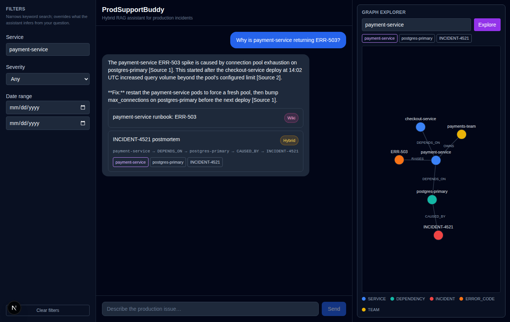
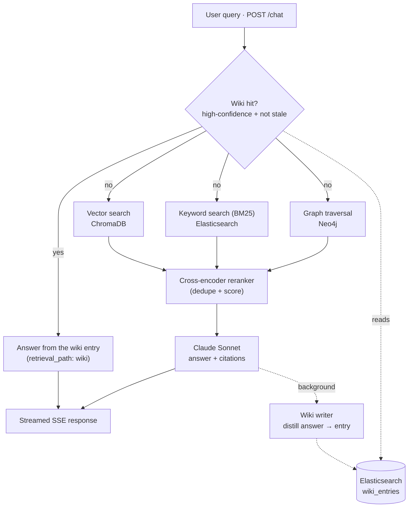
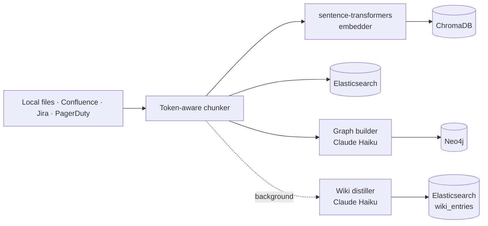

# ProdSupportBuddy

[](https://github.com/SuhaibHasan/ProdSupportBuddy/actions/workflows/ci.yml)
[](LICENSE)

A RAG-powered assistant that helps engineers resolve production incidents by retrieving
relevant runbooks, postmortems, and prior incidents from a hybrid vector/keyword/graph
knowledge base and answering with a Claude model — then **teaching itself** from every
incident it helps resolve.

Two things make this more than a standard "chat with your docs" RAG app:

- **Three retrieval strategies fused, not just one.** A question is answered from vector
  similarity (Chroma), BM25 keyword search (Elasticsearch), *and* multi-hop graph traversal
  (Neo4j) at once, cross-encoder reranked into a single context. Exact error codes, fuzzy
  "what's usually wrong with X" questions, and "what does this outage affect downstream"
  questions each have a retrieval path suited to them, and citations are tagged with exactly
  which one(s) contributed.
- **A self-maintaining wiki sits in front of the RAG pipeline.** Every answer the LLM
  generates gets distilled into a structured, confidence-scored wiki entry in the background.
  The next time a similar question comes in, a high-confidence, still-fresh entry short-circuits
  the entire retrieve→rerank→generate pipeline — cheaper and faster than a full RAG pass. Entries
  decay: they go stale on a TTL, get re-validated or rebuilt against their source documents on a
  schedule, and soft-delete themselves if their source material disappears. See
  [The wiki layer](#the-wiki-layer) below.

Also graceful under failure: every external dependency (Redis, Chroma, Elasticsearch, Neo4j,
the reranker's model weights) can go down independently without taking `/chat` with it — see
[Resilience](#resilience).



*Answer citations are tagged by which retriever(s) contributed (Wiki fast path, Hybrid
vector+keyword, ...); clicking an entity chip in a citation's graph path pivots the Graph
Explorer to that entity's subgraph.*

## Architecture



Ingestion runs the same documents into all three stores plus the wiki layer:



## Structure

```
ingestion/    loaders, chunkers, embedders, and an LLM-based Neo4j graph builder
retrieval/    vector (Chroma), keyword (Elasticsearch), and graph (Neo4j) retrievers,
              a cross-encoder reranker (with a no-ML fallback), and the streaming answer generator
wiki/         the self-maintaining knowledge base: schema, ES access, distillation,
              wiki-first retrieval, RAG-feedback writer, and staleness invalidation
api/          FastAPI service: streaming /chat, /ingest, /graph/explore, /health, /wiki/*
ui/           Next.js chat frontend
tests/        unit tests, eval tests (retrieval metrics + full-stack integration),
              and a Neo4j-testcontainer suite for the graph builder
```

## Prerequisites

- [uv](https://docs.astral.sh/uv/) for Python dependency management
- Node.js 18+ for the UI
- Docker + Docker Compose for the backing stores

## Backing services

Start ChromaDB, Elasticsearch, Neo4j, and Redis:

```bash
docker compose up -d
```

| Service       | Port(s)      | Data volume     |
|---------------|--------------|-----------------|
| ChromaDB      | 8000         | chroma_data     |
| Elasticsearch | 9200         | es_data         |
| Neo4j         | 7474 / 7687  | neo4j_data      |
| Redis         | 6379         | redis_data      |

Neo4j Browser credentials default to `neo4j` / `prodsupportbuddy` (see `docker-compose.yml`).

## API

```bash
cp .env.example .env   # fill in ANTHROPIC_API_KEY
uv sync
uv run uvicorn api.main:app --reload --port 8080
```

### Auth

`POST /ingest`, `POST /wiki/{id}/validate`, and `DELETE /wiki/{id}` check an `X-API-Key` header
against `Settings.api_key` (`api/auth.py`). Leave `API_KEY` unset in `.env` to leave them open —
useful for local dev, or a read-mostly public demo where `/chat` and the wiki read endpoints
still need to work without a key. Set it to lock ingestion and wiki writes down before exposing
this publicly.

### Endpoints

**`POST /chat`** — `{ session_id?, message, filters?: { service?, severity?, date_from?, date_to? } }`,
streamed back as Server-Sent Events:

```
event: session
data: {"session_id": "..."}

event: token
data: {"text": "Restart "}

event: token
data: {"text": "the payment-service pods."}

event: citations
data: {"citations": [{"title": "...", "url": "...", "retrieval_path": "graph+keyword", "graph_path": "..."}]}

event: done
data: {}
```

A missing `session_id` is generated server-side and echoed back in the first event so the
client can persist it for follow-up turns. `filters.*` are passed to the keyword retriever and
take precedence over whatever it infers from the query text itself (see Retrieval below).
Conversation history is stored in Redis per `session_id` with a 1-hour TTL, and the last 5
turns are included in every prompt for follow-up context. Each session is rate-limited to 10
requests/minute via a Redis sorted-set sliding window; requests beyond that get `429`.

Before touching any of that, every request checks the wiki first (see
[The wiki layer](#the-wiki-layer)) — a high-confidence, fresh entry short-circuits straight to
an answer, tagged `retrieval_path: "wiki"` in its citation. Whichever path answers it, the
result feeds back into the wiki in the background.

**`POST /ingest`** *(requires API key if configured)* —
`{ source_type: "local"|"confluence"|"pagerduty"|"jira", path?, space_key?, jql? }` kicks off
ingestion + graph building for one source as a FastAPI background task and returns `202`
immediately (`path` is required for `local`/`pagerduty`; Confluence/Jira credentials come
from `.env`). Every newly-ingested document is also queued for background wiki distillation
and invalidation of any existing entries that cite it.

**`GET /graph/explore?entity_name=auth-service`** — returns the 2-hop subgraph around a named
entity as `{ nodes: [{id, name, labels}], edges: [{source, target, type}] }` for frontend graph
visualization (no LLM call — the entity name is taken literally, unlike `/chat`'s retrieval).

**`GET /health`** — constructs and pings Redis, ChromaDB, Elasticsearch, and Neo4j, and checks
the wiki index and the invalidation scheduler; `200` with per-service `ok`/`error: ...` status
and an overall `ok`/`degraded`. Every check (including client construction, which can itself
fail — e.g. Chroma validates connectivity at construction time) is independently caught, so a
dependency being down is reported as degraded rather than 500ing the health check itself.

**`GET /wiki/search?q=<query>&min_confidence=0.5`** — ES `multi_match` over `title`/`summary`/`tags`,
filtered to `confidence >= min_confidence`, top 5 results paired with their raw ES `_score`.

**`GET /wiki/{id}`** — fetch a single wiki entry, `404` if it doesn't exist.

**`POST /wiki/{id}/validate`** *(requires API key if configured)* — engineer-validated
endpoint: bumps `confidence` by `0.1` (capped at `0.95`), resets `last_validated` to now, and
returns the updated entry. Takes a required `X-Engineer-Id` header (currently just logged —
there's no per-engineer auth yet, only the shared API key gating the endpoint itself).

**`DELETE /wiki/{id}`** *(requires API key if configured)* — soft delete: sets `confidence` to
`0.0` so the entry drops out of search/the wiki-first fast path, without removing the document
from Elasticsearch.

**`GET /wiki/stats`** — `{ total_entries, avg_confidence, total_hits, stale_count,
high_confidence_count }` across the wiki index.

### Tracing

Every `/chat` request is wrapped in nested OpenTelemetry spans: `query_routing` (the whole
request) → `retrieval.vector` / `retrieval.keyword` / `retrieval.graph` (run concurrently) →
`reranking` → `llm_call`. Spans print to the console by default (`api/telemetry.py`) — swap in
an OTLP exporter there to ship to a real collector.

## Ingest documents

```bash
uv run python -m ingestion \
  --local-dir path/to/runbooks \
  --pagerduty-dir path/to/pagerduty_exports \
  --confluence-space OPS \
  --jira-jql "project = OPS AND created >= -30d"
```

Pass any combination of the four flags; each corresponds to a loader:

| Flag                 | Source                                             |
|----------------------|-----------------------------------------------------|
| `--local-dir`        | Local `.md` / `.pdf` runbooks                       |
| `--pagerduty-dir`    | Directory of PagerDuty incident JSON exports        |
| `--confluence-space` | Confluence Cloud REST API (needs `CONFLUENCE_*` env)|
| `--jira-jql`         | Jira Cloud REST API search (needs `JIRA_*` env)     |

Credentials for Confluence/Jira are read from `CONFLUENCE_BASE_URL` / `CONFLUENCE_EMAIL` /
`CONFLUENCE_API_TOKEN` and `JIRA_BASE_URL` / `JIRA_EMAIL` / `JIRA_API_TOKEN` (see `.env.example`).
The same loaders and credentials back `POST /ingest`. If a source is unreachable, that source's
documents simply aren't ingested for that run — it doesn't affect documents already ingested
from other sources, or the app in general.

The pipeline chunks documents with a token-aware `RecursiveCharacterTextSplitter`
(512 tokens / 50 overlap), embeds chunks locally with `sentence-transformers`
(`all-MiniLM-L6-v2`, no external API), and upserts into:

- **ChromaDB** collection `prod_docs` — vector search
- **Elasticsearch** index `prod_docs` — BM25 over `content`, `title`, `tags`, `severity`, `service`

Every chunk carries `title`, `url`, `source_type`, `incident_date`, `severity`, and
`service_tags` metadata through to both stores. Chunk IDs are deterministic
(`doc_id::chunk_index`), and both stores are upserted by that ID, so re-running the
pipeline over the same sources is idempotent rather than creating duplicates.

### Graph extraction

`ingestion/graph_builder.py` calls Claude Haiku once per chunk (concurrently, via an async
Neo4j driver) to extract entities and relationships, using tool-use to force a structured
response matching:

```
entities:      [{id, name, type}]
relationships: [{from, to, type, description}]
```

Entity types: `SERVICE`, `ERROR_CODE`, `RUNBOOK`, `INCIDENT`, `TEAM`, `DEPENDENCY`, `CONFIG`.
Relationship types: `CAUSED_BY`, `DEPENDS_ON`, `OWNED_BY`, `RESOLVED_BY`, `TRIGGERS`,
`MITIGATED_BY`.

- Entities are upserted as Neo4j nodes **labeled by their type** (e.g. `(:SERVICE {name: ...})`),
  `MERGE`d on `(label, name)` so the same real-world entity dedupes across chunks/documents
  even though the model invents a fresh local `id` on every call.
- Relationships are upserted as typed edges (e.g. `(:ERROR_CODE)-[:CAUSED_BY]->(:SERVICE)`)
  carrying `description` and `source_doc_id` properties.
- Every entity is linked to its source chunk via `(entity)-[:MENTIONED_IN]->(:Chunk {id})`.
  Neo4j only stores that `chunk_id` join key — `Neo4jGraphRetriever` hydrates the actual text
  by looking the id up in Chroma at query time, so graph traversal and vector/keyword search
  stay hybrid without duplicating content across stores.
- A chunk where extraction fails or returns no entities is skipped rather than failing the
  whole ingestion run.

## Retrieval

Each of the three retrievers implements the same
`BaseRetriever.retrieve(query, top_k=10, filters=None)` interface and is fused by
`CrossEncoderReranker`. `filters` is only meaningful to the keyword retriever (vector/graph
accept and ignore it); it's how `POST /chat`'s `filters.service`/`filters.severity` reach ES.

- **`ChromaVectorRetriever`** — embeds the query with the same `sentence-transformers`
  (`all-MiniLM-L6-v2`) model used at ingest time and does a cosine-similarity search.
- **`ElasticsearchKeywordRetriever`** — runs a `multi_match` BM25 query across `content`,
  `title`, `tags`, `service`, and separately calls Claude Haiku to extract structured filters
  from the query (`service`, `severity`, `error_code`, `date_range`), applying them as ES
  `filter` clauses (case-insensitive `term` filters for service/severity, a phrase filter on
  `content` for error codes since there's no dedicated field for them, and a `range` filter on
  `incident_date`). Explicit `filters` from the request override the LLM's guess for
  service/severity. If extraction fails, it falls back to an unfiltered BM25 search rather than
  failing the query.
- **`Neo4jGraphRetriever`** — calls Claude Haiku to extract the services, error codes, and
  incident identifiers mentioned in the query, then traverses up to 2 hops from those entities
  in the semantic graph (`MATCH (n)-[r*1..2]-(m) WHERE toLower(n.name) IN $entities ...`,
  excluding `MENTIONED_IN` hops so it stays in the entity graph rather than hopping through
  chunks that happen to share an unrelated entity). Each subgraph path is serialized into a
  readable arrow chain, e.g. `auth-service → DEPENDS_ON → redis-cache → CAUSED_BY →
  INCIDENT-4521`, and every node along a path is resolved back to its source chunk_id and
  hydrated from Chroma. Each returned chunk's content is prefixed with the path(s) that led to
  it, so the LLM sees both the causal reasoning chain and the supporting text, tagged
  `source_type="graph"`. It also exposes `explore_subgraph(entity_name)`, used by
  `GET /graph/explore` — the same 2-hop/no-`MENTIONED_IN` traversal, but keyed on a literal
  entity name (no LLM extraction) and returned as raw nodes/edges rather than serialized paths
  or hydrated chunks, since that's what a visualization needs instead.

### Reranking

`CrossEncoderReranker` takes each retriever's results (up to 10 each), deduplicates by
`chunk_id` — merging metadata and keeping the richer content when the same chunk was found by
more than one retriever (e.g. the graph retriever's path-prefixed content wins over a plain
vector hit) — and combines their `source_type` tags (`"vector"`, `"keyword+vector"`,
`"graph+keyword+vector"`, ...). The deduplicated candidates are then scored directly against
the query with `cross-encoder/ms-marco-MiniLM-L-6-v2` (`sentence-transformers`, fully local,
no external API) and the top 8 by that score become the unified context passed to the LLM,
each still carrying its provenance tag and metadata. If the cross-encoder can't be loaded
(e.g. no network access to HuggingFace Hub), `PassthroughReranker` is used instead — same
dedup, no ML scoring, so retrieval still works, just unranked.

### Answer generation

`AnswerGenerator` (`retrieval/answer_generator.py`) builds the final prompt to Claude Sonnet
from the reranked context: each of the top 8 chunks becomes `[Source N]: <content>`, and any
`graph_paths` carried in their metadata are collected (deduped) into a separate `[Graph
Context]:` section so the model can reason over causal chains distinctly from raw evidence
text. Its system prompt instructs the model to answer only from context and cite sources as
`[Source N]`; after the answer streams back, those citation markers are parsed out of the text
and mapped back to each chunk's `title`, `url`, and `retrieval_path` (the same provenance tag
the reranker produced, e.g. `"graph+keyword"`), plus `graph_path` when the cited chunk came
from the graph retriever. Only sources the model actually cited are returned — not every chunk
that was in context.

`astream_answer(query, context, history)` (used by `POST /chat`) streams token-by-token via
`AsyncAnthropic.messages.stream(...)` for real-time SSE delivery, prepending up to 5 prior
`(user, assistant)` turns from Redis before the new message so follow-up questions keep
context. `generate(...)` is the synchronous, non-streaming equivalent (used by tests and
anything that just wants the final answer back). `from_wiki(query, entry, history)` is the
wiki-fast-path equivalent — same streaming shape, but the prompt context is a wiki entry
formatted as structured text (title, summary, root cause, numbered resolution steps, affected
services, source references) instead of raw retrieved chunks.

## The wiki layer

Everything above is the RAG pipeline. The wiki (`wiki/`) sits in front of it as a cache that
also happens to be smarter than a cache — it's a self-maintaining, confidence-scored knowledge
base, backed by its own Elasticsearch index (`wiki_entries`).

- **`wiki/schema.py`** — `WikiEntry`: title, summary, root cause, numbered resolution steps,
  affected services, related error codes, tags, confidence (`0.0`–`1.0`), `hit_count`,
  `source_refs`, a content hash of the source material it was built from, and TTL/staleness
  bookkeeping (`is_stale` compares `last_updated` against `ttl_days`). Its `id` is a
  deterministic SHA-256 of `title + sorted(tags)`, so the same underlying knowledge always maps
  to the same entry no matter which path created it.
- **`wiki/distiller.py`** — given a batch of chunks (from ingestion, or a doc's chunks at
  invalidation time), asks Claude Haiku for a structured `WikiEntry` as JSON, or the literal
  string `"null"` if the content's too vague to be useful. Confidence is assigned by source:
  a resolved incident → `0.9`, a runbook → `0.85`, a resolved Jira ticket → `0.7`, an open one →
  `0.5`, anything else → `0.4` — ingestion-derived entries start out more trusted than
  query-derived ones.
- **`wiki/retriever.py`** — the wiki-first fast path `RagPipeline.answer_stream()` checks before
  running full RAG. Extracts services/error codes/tags/intent from the query via Haiku, builds
  a boosted ES query (services ×4, error codes ×3, tags ×2, a text match ×1, filtered to
  `confidence >= 0.5`), and only returns the top hit if it clears a normalized-score threshold
  (`0.75`) *and* isn't stale. A hit increments `hit_count` in the background and skips retrieval,
  reranking, and the full generation prompt entirely.
- **`wiki/writer.py`** — after a full RAG answer streams back, `upsert_from_rag()` asks Haiku
  whether that answer was specific and actionable enough to distill. If so, and a wiki entry
  with the same deterministic id already exists, its resolution steps / affected services /
  related error codes / tags are merged in (deduplicated, order-preserving) and its confidence
  nudges up by `0.05` (capped at `0.95`); otherwise a new entry is created at confidence `0.6` —
  lower than ingestion-derived entries, since it's inferred from one Q&A rather than source
  documents. Runs fire-and-forget in the background and never raises into the chat response.
- **`wiki/invalidator.py`** — `invalidate_stale()` runs on a 6-hour APScheduler interval
  (wired up in `api/main.py`'s startup), finds entries past their TTL, and for each one:
  re-fetches its source chunks from Chroma, and either refreshes it cheaply (content hash
  unchanged — just bump `last_validated`), rebuilds it via the distiller (content changed), or
  soft-deletes it (`confidence = 0.0`, source chunks gone entirely). `invalidate_for_doc(doc_id)`
  does the same for one document immediately, fired whenever `POST /ingest` re-ingests it, so
  other entries citing that doc as a source get refreshed too — not just the doc's own entry.

The net effect: the wiki gets *better* the more the assistant is used, not just bigger. Answers
the team has actually validated compound into cheaper, faster responses over time, while stale
or superseded knowledge quietly ages out instead of accumulating as dead weight.

## Resilience

Every external dependency is designed to degrade `/chat` rather than break it — Anthropic
itself is the one genuine hard dependency (there's no meaningful fallback for "the LLM is
down" in an LLM-based assistant):

| Dependency | If it's down |
|---|---|
| Redis | Session history is unavailable for that request (no continuity, nothing persisted); rate limiting fails open. App fully functional. |
| ChromaDB | Vector retrieval (and graph retrieval, which uses Chroma to hydrate chunk content) is skipped; the other sources still answer. App starts fine either way — nothing touches Chroma at startup. |
| Elasticsearch | Keyword retrieval and the whole wiki layer degrade independently; app still starts (the wiki index is created best-effort at boot, not required). |
| Neo4j | Graph retrieval is skipped; vector/keyword still answer. |
| HuggingFace Hub (reranker weights) | Falls back to `PassthroughReranker` (dedup, no ML scoring) instead of failing to construct. |
| Confluence / Jira / PagerDuty | That source isn't ingested for that request; everything already ingested stays searchable. |
| The periodic wiki staleness sweep | A failed sweep (e.g. ES unreachable) just retries next cycle; stale entries stop being served by the wiki fast path regardless, since that check happens at query time. |

Each of the retrievers is also isolated from the others at the orchestration layer
(`RagPipeline`): one source raising doesn't take the other two down with it the way an
unguarded `asyncio.gather` would.

## UI

```bash
cd ui
cp .env.local.example .env.local
npm install
npm run dev
```

Next.js 16 (App Router) + Tailwind, dark theme only, in three panels:

- **Chat** (`app/components/ChatPanel.tsx`) — streams `POST /chat`'s SSE response token-by-token
  (`app/lib/sse.ts` parses `text/event-stream` off a `fetch` body, since native `EventSource`
  doesn't support POST). Each assistant message renders its citations as cards
  (`CitationCard.tsx`) tagged with a retrieval-path badge — **Vector** / **Keyword** / **Graph**
  / **Wiki** / **Hybrid** when a chunk was found by more than one retriever (`lib/retrievalPath.ts`
  maps the API's `"keyword+vector"`-style tags to one of these). A citation's `graph_path` also
  renders as clickable entity chips (parsed out of the arrow-chain string by
  `lib/graphPath.ts`) that open that entity in the graph explorer.
- **Graph Explorer** (`GraphExplorer.tsx`) — a hand-rolled D3 force-directed graph (drag, zoom/pan)
  over `GET /graph/explore`'s nodes/edges, colored by label: `SERVICE` blue, `INCIDENT` red,
  `RUNBOOK` green, `TEAM` yellow (plus a few extra colors for `ERROR_CODE`/`DEPENDENCY`/`CONFIG`
  and a gray fallback). Driven either by typing an entity name or clicking a suggestion chip
  surfaced from any citation in the conversation so far.
- **Filter sidebar** (`Sidebar.tsx`) — service, severity (P1–P4), and a date range, sent as
  `POST /chat`'s `filters` and merged into the keyword retriever's query server-side (explicit
  values win over whatever it infers from the question itself).

## Tests

```bash
uv run pytest tests/unit             # fast, no external services
uv run pytest tests/wiki             # fast, no external services
uv run pytest tests/api              # fast, no external services (mocked ES/deps)
uv run pytest tests/eval             # fast, no external services (includes ragas_eval's own tests)
uv run pytest tests/integration      # spins up a real Neo4j via testcontainers (needs Docker)
RUN_INTEGRATION_TESTS=1 uv run pytest tests/eval  # requires docker compose services + ANTHROPIC_API_KEY
```

### RAGAS retrieval-quality evaluation

`tests/eval/ragas_eval.py` scores the full RAG pipeline with RAGAS across a 20-question golden dataset (`tests/eval/golden_dataset.py`) — 7 semantic (paraphrased,
no exact identifiers), 7 exact-match (error codes, incident/service names), and 6 relationship
(multi-hop ownership/dependency/causal) questions — against a fictional but internally consistent
incident/runbook corpus (`tests/eval/fixtures/runbooks/`).

```bash
uv sync --group eval
uv run python -m ingestion --local-dir tests/eval/fixtures/runbooks
uv run python tests/eval/ragas_eval.py [--limit N] [--output report.md]
```

It runs every question through four retrieval configurations — vector-only, keyword-only,
graph-only, and the full hybrid pipeline (reranked) — generating a real answer for each via
`AnswerGenerator`, then scores every (question, retrieved context, answer, ground truth) tuple
with RAGAS's `faithfulness`, `answer_relevancy`, `context_precision`, and `context_recall`,
judged by Claude through `langchain_anthropic.ChatAnthropic` wrapped in
`ragas.llms.LangchainLLMWrapper` (embeddings for `answer_relevancy` use the same
`all-MiniLM-L6-v2` model the app embeds with, via `langchain_community`'s `HuggingFaceEmbeddings`).
Output is a markdown report: an overall comparison table plus a per-category breakdown, so you
can see e.g. whether graph-only actually wins on relationship questions.

This makes real Claude API calls for every generated answer *and* every metric judgment (4
metrics × 20 questions × 4 configs), so a full run takes several minutes and real API cost — it's
a deliberate, manually-triggered report, not something that runs in CI on every commit. The
`ragas`/`langchain-anthropic`/`datasets` dependencies live in a separate `eval` uv group for the
same reason; `uv sync` alone won't install them, and `tests/eval/test_ragas_eval.py` (fast, no
network) skips itself if they're absent.

## License

[MIT](LICENSE)
